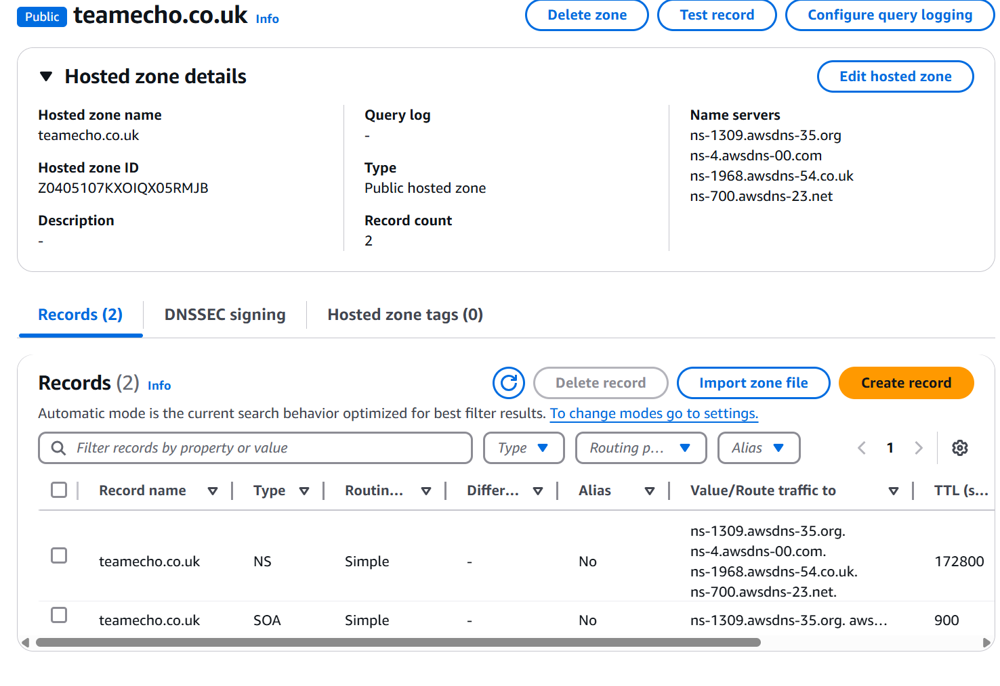
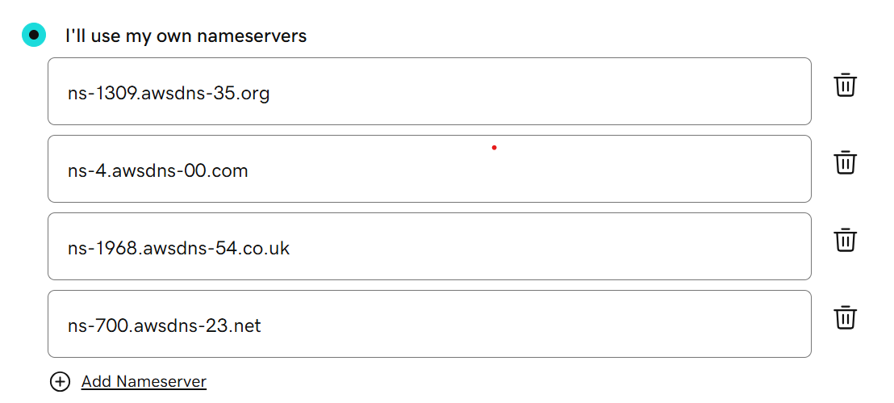
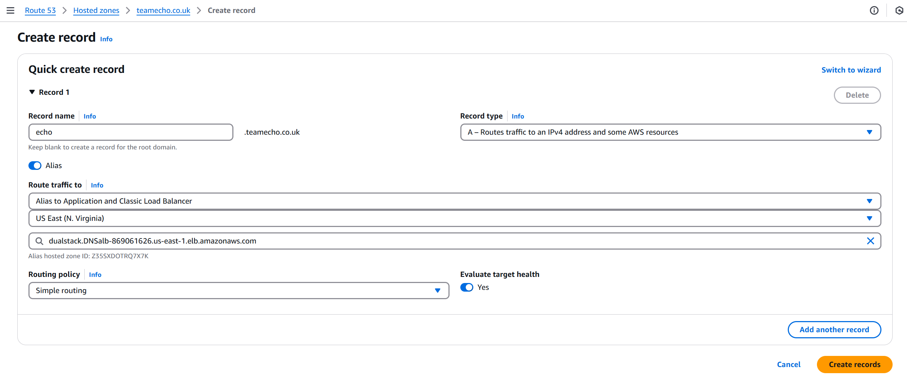
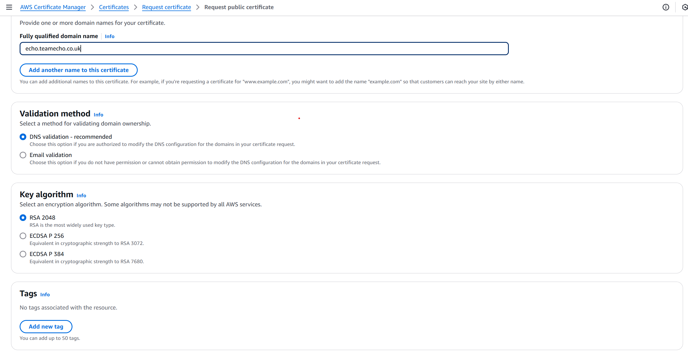
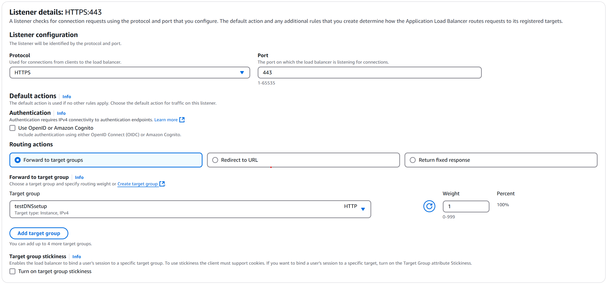
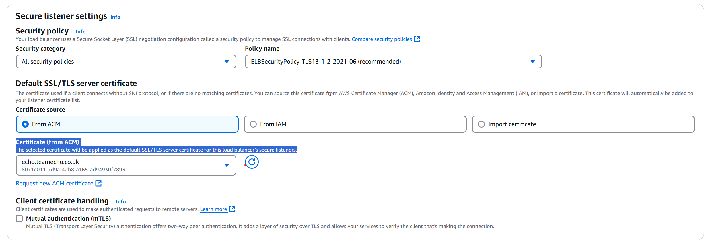

# **Route53 DNS and ACM Setup**

Complete the Route 53 configuration so the app is running on our custom domain (tm.echo.yourdomain.com).
Go through setting up the SSL certificate also.

 

<h2>Hosted Zone (echo.yourdomain.com)</h2>

- A Hosted Zone is like a DNS server that manages the DNS records for your domain.
- Create hosted zone.
- Once the Hosted Zone is created, AWS will assign a set of four Name Server (NS) records to it.

Update Name Servers at Your Domain Registrar (godaddy)

Replace the existing Name Servers with the four Name Servers provided by Route 53 in the previous step.
Note:

- DNS propagation can take up to 24-48 hours, so changes might not be immediate.

<h2>Add DNS record for ALB to the hosted zone.</h2>

<h2>Create SSL certificate via ACM (tm.echo.yourdomain.com)</h2>

- Request a certificate

- add HTTPs to application load balancer along with redirecting users using HTTP-80 to HTTPs-443

- The selected certificate will be applied as the default SSL/TLS server certificate for this load balancer’s secure listeners.

<h2>Validate certificate</h2>

